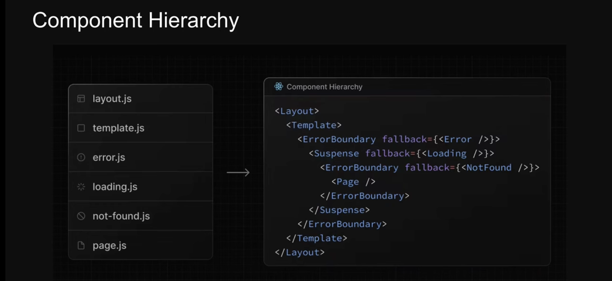
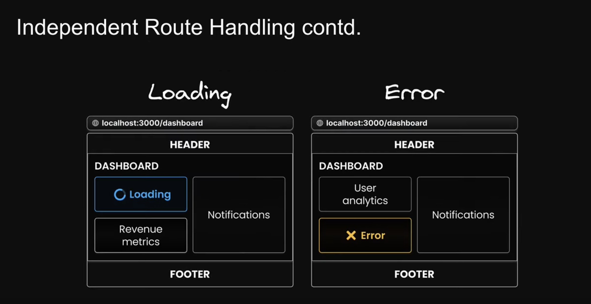
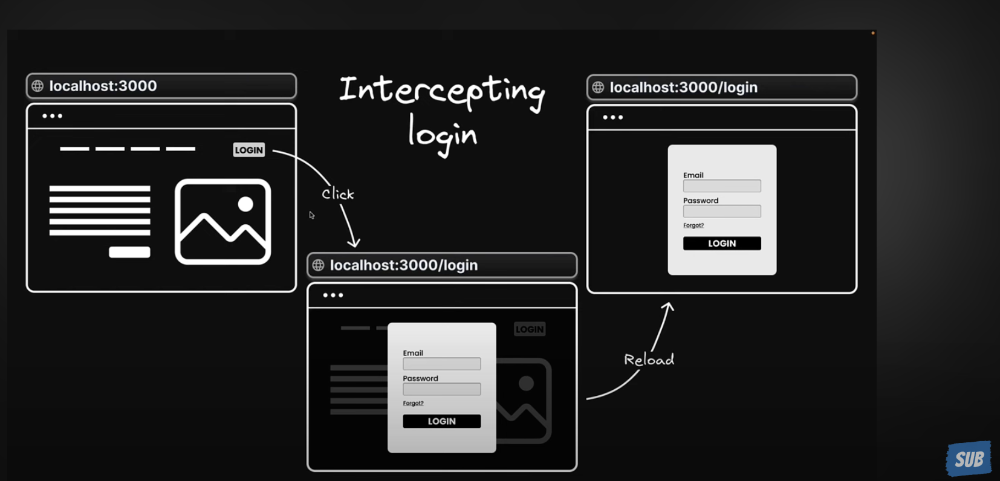

## NEXT JS
Server-side rendering (SSR): Next.js allows you to render React components on the server side before sending them to the client. This can improve page load times and SEO, as search engines can easily index the content.

Static site generation (SSG): Next.js also supports static site generation, where you can pre-render pages at build time. This approach is great for content-heavy websites and can offer even better performance and SEO benefits.

API routes: It offers a built-in API route feature that allows you to create serverless API endpoints within your Next.js project, making it easy to handle backend logic.ll

## Link
Link is a component provided by Next.js that allows you to create links to navigate between pages in your application.
It's primarily used for declarative, client-side navigation. When you click on a link created with Link, it prevents the default browser full-page refresh and fetches the new page content on the client side, resulting in a faster and smoother user experience.
It's typically used in your component's JSX code to create clickable links that lead to other pages within your Next.js application.
The <Link> component is a React component that extends the HTML `<a>` element, and it's the primary way to navigate between routes in Next.js

## useRouter()
useRouter is a hook provided by Next.js that allows you to access
the router object and its properties within your component.
It provides programmatic control over the router and allows you to navigate to different pages or perform other routing-related actions in response to user interactions or events within your component.
It's useful when you need to handle navigation or access route-specific information directly in your component logic.

## Dynamic Routes
Dynamic routes in Next.js refer to a feature that allows you to create web pages with variable or dynamic parts in the URL.
Instead of defining individual routes for every possible URL, you can create a single route pattern that matches a variety of dynamic values. This is extremely useful when you have pages that share a common structure but differ based on specific information in the URL.
/users/[id]

## Catch-All Routes
In Next.js, the [...foldername] notation indicates that you are using a catch-all route, which allows you to capture multiple URL segments and treat them as a dynamic array of values.
This is useful when you want to create dynamic routes that can handle varying numbers of URL segments.

## Layout
A layout is like a blueprint that helps you make all the pages of your website look the same. It's a way to put common things, header footer, and other stuff that appears on every page, in one place. This makes it easy to keep a similar look on all your web pages. So, a layout is a handy tool that lets you keep things tidy and consistent on your website.

## Templates
Templates are similar to layouts in that they wrap each child layout or page
But, with templates, when a user navigates between routes that share a template, a new instance of the component is mounted, DOM elements are recreated,
state is not preserved, and effects are re-synchronized.
`template.tsx`

## Middleware(s)
In Next.js, middleware's are functions or pieces of code that run in between a user's request to a web page and the server's response. They help you process and modify the request or response, adding extra functionality to your web application.

## Routing Metadata
Ensuring proper search engine optimization (SEO) is crucial for increasing visibilty and attracting users

Configuring Metadata
- Export a static metadata object
- Export a dynamic generateMetadata function

Metadata rules
- Both layout.tsx and page.tsx files can export metadata. If defined in a layout, it applies to all pages in that layout, but if defined in a page, it applies only to that page
  
Metadata is read in order, from the root level down to the final page level
When there's metadata in multiple places for the same route, they get combined, but page metadata will replace layout metadata if they have the same properties

## Loading UI :  `loading.tsx`
This file allows us to create loading states that are displayed to users while a specific route segment's content is loading
The loading state appears immediately upone navigation, giving users the assurance that the application is responsive and actively loading content.
Benefits
--------
1. You can display the loading state as soon as a user navigates to a new route.
   The immediate feedback reassures users that their action has been acknowledged, reduces perceived loading times, and makes the application feel more responsive.
2. Next.js allows the creation of shared layouts that remain interactive while new route segments are loading
   Users can continue interacting with certain parts of the application, such as a navigation menu or sidebar, even if the main content is still being fetched 

## Error handling
Benefits
1. Automatically wrap a route segment and its nested children in a React Error Boundary
2. Create error UI tailored to specific segments using the file-system hierarchy to adjust granularity
3. Isolate errors to affected segments while keeping the rest of the application functional
4. Add functionality to attempt to recover from an error without a full page reload 

## Handling Errors in Nested Routes
Errors bubble up to the closest parent error boundary
An `error.tsx` file will cater to errors for all its nested child segments
By positioning `error.tsx` files at different levels in the nested folders of a route, you can achieve a more granular leve of error handling

## Handling Errors in Layouts
An `error.tsx` file will handle errors for all  its nested child segments
The error boundary does not catch errors thrown here because it's nested inside the layouts component

## Parallel Routes
Parallel routes are an advanced routing mechanism that allows for the simultaneous rendering of multiple pages within the same layout
Parallel routes in Next.js are defined using a feature known as slots
Slots help structure our content in a modular fashion
To define a slot, we use the `@folder` naming convention
Each slot is then passed as a prop to its corresponding `layout.tsx` file  
-----
Benefits:
- A clear benefit of parallel routes is their ability to split a single layout into various slots, making the code more manageable. 
- Independent route handling
  Each slot of your layout, such as user analytics or revenue metrics can have its own loading and error states
  This granular control is particularly beneficial in scenarious where different sections of the page load at varying speeds or encounter unique errors

- Sub-navigation 
  Each slot of your dashboard can essentially function as a mini-application, complete with its own navigation and state management
  This is especially useful in a complex application such as our dashboard where different sections serve distinct purposes.

## Unmatched Routes

if this `default.tsx` file is missing in any of the unmatched slots for the current route, Next.js will render a 404 error.

## Intercepting Routes
Intercepting routes allow you to intercept or stop the default routing behaviour to present an alternate view or component when navigating through the UI, while still preserving the intended route for scenarios like page reloads.

This can be useful if you want to show a route while keeping the context of the current page.

folder name: `(.folderName)/page.tsx`

Intercepting Routes Conventions
(.) to match segments on the same level
(..) to match segments one level above
(..)(..) to match segments two levels above
(...) to match segments from the root app dir

## Parallel Intercepting Routes

## Route Hanlders
We can also create custom request handlers for our routes using a feature called route handlers

Unlike page routes, which respond with HTML content, route handlers allow you to create RESTful endpoints, giving you full control over the response

There is no overhead of having to create and configure a separate server

Route handlers are also great for making external API requests

Route handlers run server-side, ensuring that sensitive information like private keys remain secure and never gets shipped to the browser
